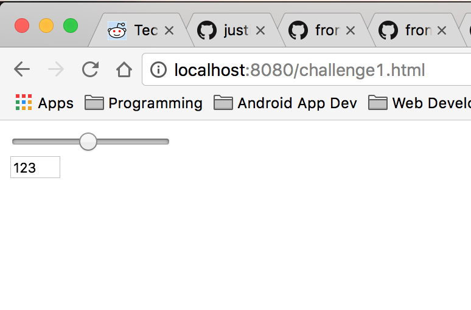
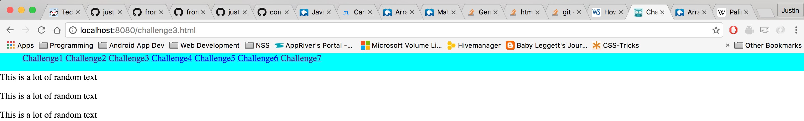
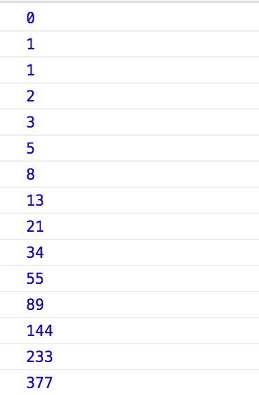
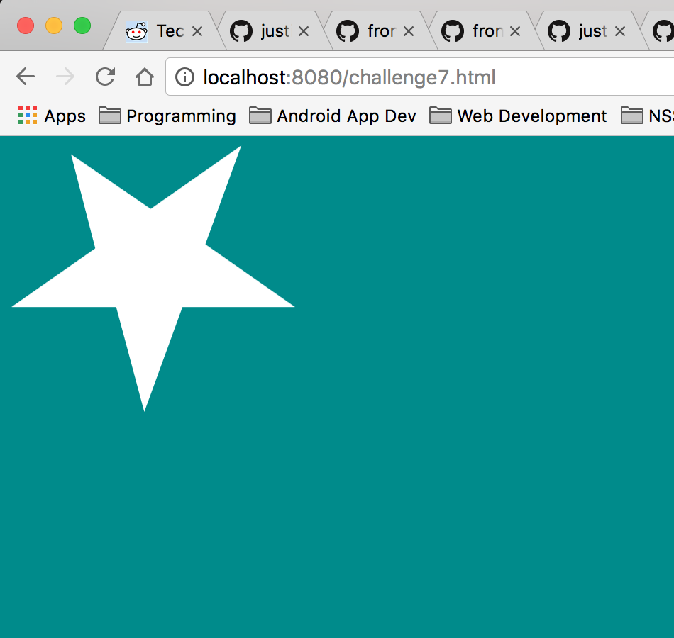
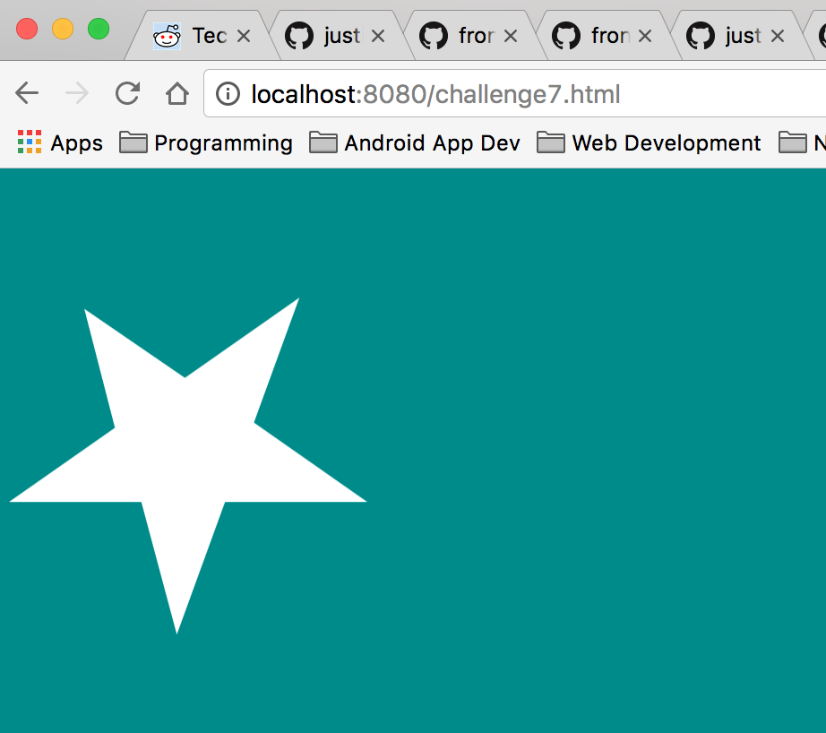

#Individual Challenge


## Description
The challenge had 7 different tasks to complete.
1. Create a slider that updated an input field with it's current value.
2. Create an interactive navigation bar.
3. Make the navigation bar stick to the top fo the page as the user scrolls down.
Challenge 4 - 6 Where about a Fibonacci number generator.
7. Was a css challenge to recreate a gif.

## How to run
In your terminal run:
```
http-server -p 9999
```
then navigate to http://localhost:9999 in your browser.

## Screenshots
##Challenge 1

##Challenge 3

##Challenge 4 - 6 Fibonacci number generator
```
// Write a Fibonacci number generator that outputs the numbers in the series that are less than 500.
// the sequence should go

var counter = 0;
var preNumber = 0;
var trashVar = 1;

// use a for loop to add the numbers
for(var i = 0; i <= 500;) {
    if (i === 0) {
        console.log(i + preNumber);
        i++;
    } else if (i <= 1) {
        console.log(i);
        preNumber = i;
        console.log(preNumber);
        i++;
    } else if (i <= 2) {
        console.log(i);
        preNumber = i;
        i++;
        console.log(i);
    } else {
        trashVar = i + preNumber;
        preNumber = i;
        i = trashVar;
        if(i <= 500) {
            console.log(i);
        }
    }
}
```
##Fibonacci output

##Challenge 7

##Challenge 7 Animated


## Contributors
- [Justin Leggett](https://github.com/justinal64)